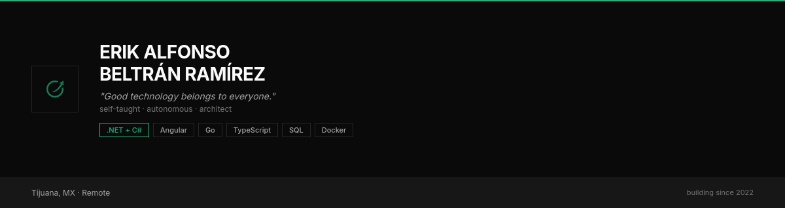

Software developer building enterprise systems, CLI tooling, and web applications.

**TSU in Software Development** · UTT, completed · **Engineering continuation** · 8th quarter
**14 months** as sole developer at **Printpack** · enterprise access control system for a manufacturing plant (37k LOC, full stack).

I build **MCP servers**, **Go CLI tools**, and **Angular/.NET applications** · looking for
a position where I can make technical, product, and strategic decisions.

---

## Featured Projects

### [snapmcp](https://github.com/reeinharddd/snapmcp) · public
All-in-one MCP server for visual captures. 8 tools via Playwright — terminal, code, browser, markdown, diffs, HTML, PDF. Published on **npm** and **ghcr.io**.

### orbe · enterprise (Printpack IP)
Enterprise access control system for a manufacturing plant. Built solo — full stack, from database to UI, with real-time hardware integration. 7 months, sole developer.

### [okit](https://github.com/reeinharddd/okit) · public
Multi-purpose CLI. 18 packages managing models, skills, MCPs, agents, routing, and runtime config. SDD-TDD hybrid workflow with progressive coverage targets.

### [sys-inspector](https://github.com/reeinharddd/sys-inspector) · public
Universal system inspection for AI agents. 16 detectors across tools, hardware, runtimes, services, network, and security. Zero dependencies.

---

## Concepts & Archives

Ideas I explored and built — not actively maintained, but the architecture and approach still inform my work.

### [brain](https://github.com/reeinharddd/brain) · public archive
AI engineering control plane — daemon-centered orchestrator. **62k LOC Go**, 46% test coverage, 9 MCP servers, 13 agents, multi-provider LLM orchestration, OpenTelemetry instrumentation. 7 Architecture Decision Records.

### [bks](https://github.com/Reinharrrd/bks) · public archive
RAG knowledge management system — document ingestion across 5 formats (PDF, DOCX, images), hybrid search with FTS5 full-text + vector + RRF reranking, MCP server with 5 tools. 11 Architecture Decision Records.

---

## Toolbox

---

## Connect

[LinkedIn](https://www.linkedin.com/in/erik-beltran-dev/) · [Email](mailto:beltraberik@gmail.com) · [Landing](https://www.erik-beltran.dev/en/)